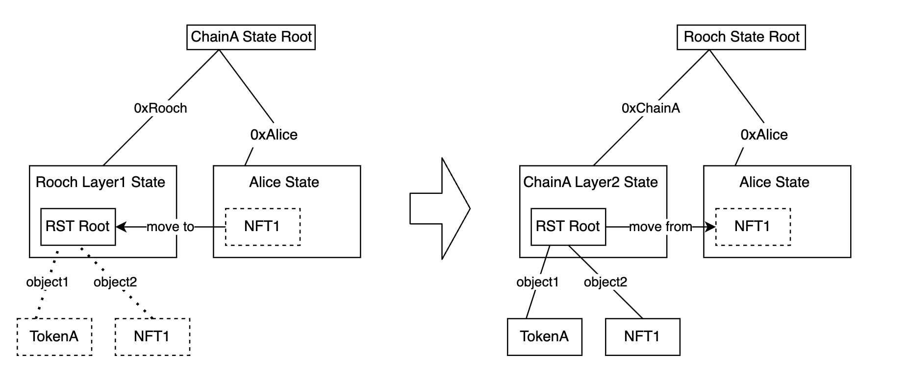

# rollup-nft

English|[中文](./README_zh.md)

A rollup tools for massively issuing NFTs. This is a demonstration project used to validate ideas for state scaling.

a Rollup NFT issuing tool. This is a demo project used to validate ideas for state scaling and the interoperability of Layer1 and Layer2 based on Object mode.

## Background Description

We hope that the blockchain can support a large number of users, which will inevitably generate a large amount of smart contract state. For example, giving billions of users a personalized NFT avatar, or making every image on a Web3 Instagram an NFT, or every tweet on a Web3 Twitter an NFT. Another example would be using AI to generate a large number of valuable digital content, and the best way to store and transfer them would be through NFTs on the blockchain.

So how should we define and express these digital assets through smart contracts? If we solve the execution and storage problems of smart contracts through various scalability solutions, another problem is how these state assets can bridge between Layer1 and Layer2. Are these assets necessarily defined on Layer 1? How do assets initially issued on Layer2 get bridged to Layer1, and even cross between different Layer2s? Can we ensure consistency of asset type across different Layers, instead of mapping them?

These are all open-ended questions, and currently, there are no good solutions. However, we are exploring this direction to find some answers.



## Technical Approach

1. Borrowing from the object model in Move, we introduce a new NFT definition method based on Object Struct in Solidity.
2. Implement an off-chain state tree based on Sparse Merkle Tree (SMT).
3. Store only the root of the state tree on-chain, and implement on-chain SMT with Solidity.
4. Provide a RollupNFT specification.
5. RollupNFT provides two update methods:
    1. Fully on-chain update: Apart from the initialize issuance of NFTs, new NFTs need to generate a new root of the status tree through the non-inclusion proof of the SMT. In this case, asset safety is guaranteed by the on-chain smart contract.
    2. Allow off-chain update: The off-chain state tree can be updated directly and the root of the state tree is periodically submitted to the chain. In this case, asset safety needs to be guaranteed through other means, such as fraud proofs or ZK Prover.
6. Mount this SMT into Rooch's Layer2, which will be expressed as a Table structure in Move contract. Developers can read or move NFT objects from this Table in Move contract and process or combine them.


## Technical Solution

### Defining NFT Objects in Solidity

```solidity
    struct ERC721 {
        //object id
        bytes32 id;
        //contract address
        address contractAddress;
        uint256 tokenId;
        // reference to metadata
        bytes32 metadataId;
    }

    struct Metadata{
        bytes32 id;
        string name;
        string description;
        string image;
        string animation_url;
        string external_url;
        string background_color;
        string youtube_url;
        string[] attributes_key;
        string[] attributes_value; 
    }

    struct Object{
        bytes data;
        address owner;
    }
```

This definition method leaves room for future scalability. For example, if there is a new NFT standard beyond ERC721 in the future, we only need to define a new struct, and the Object itself does not need to be changed, nor does the cross-layer solution.[NFTObject](./solidity-rst/contracts/NFTObject.sol)

### Defining the RollupNFT Standard

```solidity
    interface IRollupNFT is IERC721 {
        /// Mint Offchain NFT on-chain with inclusion proof
        function mintWithProof(bytes calldata objectBytes, bytes calldata inclusionProof) external;

        /// Move on-chain NFT to Offchain and burn on-chain with no inclusion proof
        function moveToOffchain(uint256 tokenId, bytes calldata noInclusionProof) external;

        /// Prove ownership of a certain NFT with the inclusion proof
        function ownerOfWithProof(bytes calldata objectBytes, bytes calldata inclusionProof) external view returns (address) ;
    }
```
Basic implementation: [RollupNFT](./solidity-rst/contracts/RollupNFT.sol)
Usage example: [ExampleRollupNFT](./solidity-rst/contracts/ExampleRollupNFT.sol)


### Defining Move ERC721 NFT Object in Move

```rust
    struct ERC721 has key{
        id: UID,
        contract_address: EVMAddress,
        token_id: u256, 
        metadataID: ObjectRef,
    }

    struct Metadata has key{
        id: UID,
        name: String,
        description: String,
        image: String,
        animation_url: String,
        external_url: String,
        background_color: String,
        youtube_url: String,
        attributes_key: vector<String>,
        attributes_value: vector<String>, 
    }

```

## Project Goals

1. Explore the feasibility of expressing NFT through Object mode in Solidity and its interoperability with Move through Object mode.
2. Provide Solidity contract examples.
3. Provide Move contract examples.
4. Provide a tool to generate the Offchain state tree and demo project (not yet completed).


