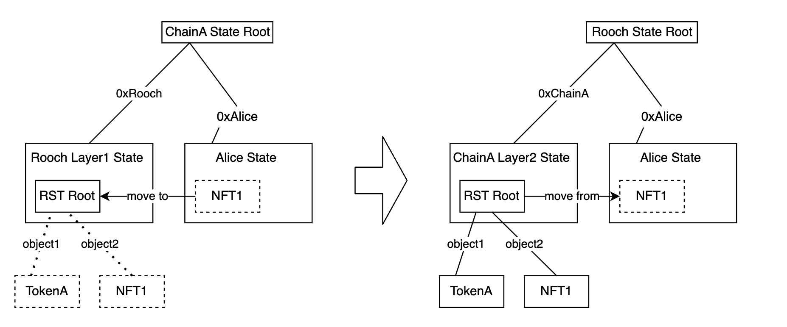

# rollup-nft

[English](./README.md)|中文

Rollup NFT 发行工具。这是一个演示项目，用来验证状态扩容以及 Layer1 和 Layer2 基于 Object 模式互操作的想法。

## 背景描述

我们希望区块链能支撑大规模用户，而大规模用户必然产生大规模的智能合约状态。
比如给数亿用户每个用户一个头像 NFT？比如 Web3 Instagram 上的每张图片都是一个 NFT？Web3 Twitter 上的每条 tweet 都是一个 NFT？再比如通过 AI 生成大量的有价值的数字内容，最佳的载体应该也是链上的 NFT。

那我们应该如何通过智能合约定义和表达这些数字资产？假如我们通过各种扩容方案解决了智能合约的执行以及状态存储难题，另外一个问题是这些状态资产如何在 Layer1 和 Layer2 之间流通？这些资产是否一定定义在 Layer 1？初始发行在 Layer2 上的资产如何跨桥到 Layer1？乃至 Layer2 之间互跨？能否保证资产类型标志在不同的 Layer 之间的一致性？而不是通过映射的方式。

这些问题都是开放式问题，当前并没有很好的解决方案。但我们正在尝试再这个方向上进行一些探索。


## 技术思路

1. 借鉴 Move 中的 Object 模型，在 Solidity 中引入一种基于 Object Struct 的 NFT 定义方式。
2. 基于 （SMT）Sparse Merkle Tree 实现一个 Offchain 的状态树。
3. 链上只保存状态树的根，同时需要用 Solidity 实现链上 SMT。
4. 提供一种 RollupNFT 的规范。
5. RollupNFT 提供两种更新方案：
   1. 完全链上更新，除了初始化发行之外，新增 NFT 需要通过 SMT 的不存在证明 + 新的 NFT 生成新的状态树的根。这种情况下资产安全由链上智能合约保证。
   2. 允许链下更新，链下的状态树可以直接更新，并定时提交状态树的根到链上。这种情况下资产安全需要通过其他方式保证，比如欺诈证明或者 ZK Prover。
6. 将这个 SMT 挂载到 Rooch 的 Layer2 中，它在 Move 合约中会表达为一个 Table 结构，开发者可以在 Move 合约中从这个 Table 读取 NFT Object，并进行处理或者组合。


## 技术方案

### 定义 Solidity 中的 NFT Object

```solidity
    struct ERC721 {
        //object id
        bytes32 id;
        //contract address
        address contractAddress;
        uint256 tokenId;
        // reference to metadata
        bytes32 metadataId;
    }

    struct Metadata{
        bytes32 id;
        string name;
        string description;
        string image;
        string animation_url;
        string external_url;
        string background_color;
        string youtube_url;
        string[] attributes_key;
        string[] attributes_value; 
    }

    struct Object{
        bytes data;
        address owner;
    }
```

这种定义方式给未来留了扩展性，比如未来有 ERC721 之外的 NFT 标准，也只需要新定义一种 struct，而 Object 本身不需要变更, 跨层的方案也不需要变更。[NFTObject](./solidity-rst/contracts/NFTObject.sol)

### 定义 RollupNFT 标准

```solidity
    interface IRollupNFT is IERC721 {
        /// 通过包含证明，将 Offchain 的 NFT 在链上 mint 出来
        function mintWithProof(bytes calldata objectBytes, bytes calldata inclusionProof) external;

        /// 通过未包含证明，将 Onchain 的 NFT 移动到 Offchain，并在链上 burn 掉
        function moveToOffchain(uint256 tokenId, bytes calldata noInclusionProof) external;

        /// 通过包含证明，证明对某个 NFT 的所有权
        function ownerOfWithProof(bytes calldata objectBytes, bytes calldata inclusionProof) external view returns (address) ;
    }
```

基础实现：[RollupNFT](./solidity-rst/contracts/RollupNFT.sol)
使用案例：[ExampleRollupNFT](./solidity-rst/contracts/ExampleRollupNFT.sol)


### 定义 Move 的 NFT Object

```rust
    struct ERC721 has key{
        id: UID,
        contract_address: EVMAddress,
        token_id: u256, 
        metadataID: ObjectRef,
    }

    struct Metadata has key{
        id: UID,
        name: String,
        description: String,
        image: String,
        animation_url: String,
        external_url: String,
        background_color: String,
        youtube_url: String,
        attributes_key: vector<String>,
        attributes_value: vector<String>, 
    }

```

## 项目目标

1. 研究在 Solidity 中通过 Object 模式表达 NFT，并和 Move 通过 Object 模式互通的可行性。
2. 给出 Solidity 的合约示例
3. 给出 Move 的合约示例
4. 提供一个工具用来生成 Offchain 的 State Tree 以及 Demo 项目（未完成）

## 介绍视频
1. https://youtu.be/lmaYbDG-1Xg